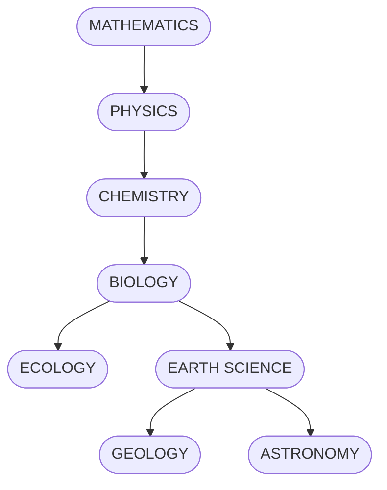

```markdown
# Science Flowchart

A living, version-controlled map of the scientific disciplines and how they interconnect.  
All of the chart’s nodes and edges live in one “master” file—`diagrams/core-sciences.mmd`—which is pulled into both:

- **`docs/index.html`** (for GitLab Pages and local preview)  
- **This README** (so you get an inline diagram here, too)

---

## 📁 Project structure

```

/
├── diagrams/
│   └── core-sciences.mmd     ← Mermaid source (single source-of-truth)
├── docs/
│   ├── index.html            ← Loads & renders core-sciences.mmd via Mermaid
│   └── assets/
│       ├── css/style.css     ← Custom styling
│       └── js/mermaid-init.js← Mermaid configuration
├── .gitlab-ci.yml            ← (optional) CI to publish `docs/` as Pages
├── README.md                 ← You are here (flows from core-sciences.mmd)
└── LICENSE                   ← Apache 2.0

````

---

## 🚀 How to view the flowchart

### 1. Local preview

```bash
cd docs
python3 -m http.server 8000
````

Open your browser to [http://localhost:8000](http://localhost:8000) and you’ll see the live flowchart rendered from `diagrams/core-sciences.mmd`.

### 2. Publish on GitLab Pages

1. Commit & push to `main` (with a `.gitlab-ci.yml` that copies `docs/ → public/`).
2. In GitLab go to **Settings → Pages** to find your site URL:

   ```
   https://<your-namespace>.gitlab.io/<your-project>/
   ```
3. Visit that URL for your live, interactive Science Flowchart.

---

## 🔄 Single source-of-truth

All chart content lives in one file:

```text
diagrams/core-sciences.mmd
```

* **To extend**: edit that file, add new nodes/edges, commit & push.
* **To sync the README**: copy the updated block from `core-sciences.mmd` into the “Flowchart” section below so your inline preview stays current.

---

## 🖼️ Flowchart



---

## 🤝 Contributing

1. **Edit** `diagrams/core-sciences.mmd` — add subfields, cross-links, etc.
2. **Commit & push** your changes.
3. **Refresh** your browser (local or Pages) **and** update the Mermaid block above in this README.

---

## 📄 License

Apache 2.0 © 2025 Your Name

```
```
