# Science Flowchart

A living, version-controlled map of the scientific disciplines and how they interconnect.  
The single source-of-truth for the diagram is  
```

diagrams/core-sciences.mmd

```
which is rendered in both:

- **`docs/index.html`** (for local preview and GitLab Pages)  
- **This README** (inline, via Mermaid)

---

## Project layout

```

/
├── data/                   # optional: raw taxonomy (JSON/YAML)
│   └── disciplines.json
├── diagrams/
│   └── core-sciences.mmd   ← master Mermaid file
├── docs/                   # GitLab Pages site & local preview
│   ├── index.html
│   └── assets/
│       ├── css/style.css
│       └── js/mermaid-init.js
├── scripts/
│   └── gen\_mermaid.py      # (optional) regenerates core-sciences.mmd
├── .gitlab-ci.yml          # CI to publish `docs/` as Pages
├── README.md               ← you are here
└── LICENSE

````

---

## 1. View locally

Serve the **project root** on port 8000:

```bash
python3 -m http.server 8000
````

Then open in your browser:

```
http://localhost:8000/docs/index.html
```

This page will fetch and render `diagrams/core-sciences.mmd` via Mermaid.

---

## 2. Publish on GitLab Pages

1. Ensure `.gitlab-ci.yml` copies `docs/ -> public/`.
2. Push to the `main` branch.
3. In GitLab, go to **Settings → Pages** for your site URL:

   ```
   https://<namespace>.gitlab.io/<project>/
   ```
4. Visit that URL to see your live, interactive Science Flowchart.

---

## 3. Single source-of-truth

All chart content lives in one file:

```
diagrams/core-sciences.mmd
```

**To extend**: edit that file, add or reorganize nodes/arrows, then commit & push.
On load (local or Pages), the diagram updates automatically.

---

## 4. Inline flowchart

Below is the full flowchart as rendered here in GitHub-compatible Markdown.
(The same content is in `diagrams/core-sciences.mmd`.)

```mermaid
flowchart TD
  %% Formal Sciences
  subgraph FS["Formal Sciences"]
    direction TB
    FS_ROOT[Formal Sciences]
    MATH[Mathematics]
    PURE_MATH[Pure Mathematics]
    APPL_MATH[Applied Mathematics]
    STAT[Statistics]
    LOGIC[Logic]
    SYS_THEORY[Systems Theory]
    DECISION[Decision Theory]
    INFO_SCI[Information Science]
    DATA_SCI[Data Science]
    TCS[Theoretical Computer Science]
    ALGO[Algorithms]
    COMP_COMPLEX[Computational Complexity]
    ML[Machine Learning]
    CRYPTO[Cryptography]

    FS_ROOT --> MATH
    MATH --> PURE_MATH
    MATH --> APPL_MATH
    MATH --> STAT
    FS_ROOT --> LOGIC
    LOGIC --> TCS
    TCS --> ALGO
    TCS --> COMP_COMPLEX
    FS_ROOT --> SYS_THEORY
    FS_ROOT --> DECISION
    FS_ROOT --> INFO_SCI
    INFO_SCI --> DATA_SCI
    FS_ROOT --> DATA_SCI
    FS_ROOT --> ML
    FS_ROOT --> CRYPTO
  end

  %% Natural Sciences
  subgraph NS["Natural Sciences"]
    direction TB
    NS_ROOT[Natural Sciences]
    PHYS[Physics]
    THEO_PHYS[Theoretical Physics]
    EXP_PHYS[Experimental Physics]
    ASTRO[Astrophysics]
    PART_PHYS[Particle Physics]
    COND_MAT[Condensed Matter Physics]
    NS_ROOT --> PHYS
    PHYS --> THEO_PHYS
    PHYS --> EXP_PHYS
    PHYS --> ASTRO
    PHYS --> PART_PHYS
    PHYS --> COND_MAT

    CHEM[Chemistry]
    ORG_CHEM[Organic Chemistry]
    INORG_CHEM[Inorganic Chemistry]
    PHYSCHEM[Physical Chemistry]
    ANALYTIC[Analytical Chemistry]
    BIOCHEM[Biochemistry]
    NS_ROOT --> CHEM
    CHEM --> ORG_CHEM
    CHEM --> INORG_CHEM
    CHEM --> PHYSCHEM
    CHEM --> ANALYTIC
    CHEM --> BIOCHEM

    BIO[Biology]
    MOL_BIO[Molecular Biology]
    CELL_BIO[Cell Biology]
    GEN[Genetics]
    MICRO[Microbiology]
    BOTANY[Botany]
    ZOOLOGY[Zoology]
    ECO[Ecology]
    NS_ROOT --> BIO
    BIO --> MOL_BIO
    BIO --> CELL_BIO
    BIO --> GEN
    BIO --> MICRO
    BIO --> BOTANY
    BIO --> ZOOLOGY
    BIO --> ECO

    EARTH[Earth Science]
    GEO[Geology]
    METEO[Meteorology]
    OCEANO[Oceanography]
    CLIMO[Climatology]
    ENV_SCI[Environmental Science]
    NS_ROOT --> EARTH
    EARTH --> GEO
    EARTH --> METEO
    EARTH --> OCEANO
    EARTH --> CLIMO
    EARTH --> ENV_SCI
  end

  %% Social Sciences
  subgraph SS["Social Sciences"]
    direction TB
    SS_ROOT[Social Sciences]
    PSY[Psychology]
    COG_PSY[Cognitive Psychology]
    SOC_PSY[Social Psychology]
    SOC[Sociology]
    ANTH[Anthropology]
    CULT_ANTH[Cultural Anthropology]
    ARCHY[Archaeology]
    ECON[Economics]
    BEHAV_ECON[Behavioral Economics]
    POLSCI[Political Science]
    INT_REL[International Relations]
    HUM_GEO[Human Geography]
    LING[Linguistics]
    SOCIOLING[Sociolinguistics]
    PSYCHOLING[Psycholinguistics]
    EDU[Education]

    SS_ROOT --> PSY
    PSY --> COG_PSY
    PSY --> SOC_PSY
    SS_ROOT --> SOC
    SS_ROOT --> ANTH
    ANTH --> CULT_ANTH
    ANTH --> ARCHY
    SS_ROOT --> ECON
    ECON --> BEHAV_ECON
    SS_ROOT --> POLSCI
    POLSCI --> INT_REL
    SS_ROOT --> HUM_GEO
    SS_ROOT --> LING
    LING --> SOCIOLING
    LING --> PSYCHOLING
    SS_ROOT --> EDU
  end

  %% Applied Sciences
  subgraph AS["Applied Sciences"]
    direction TB
    AS_ROOT[Applied Sciences]
    ENG[Engineering]
    MECH_ENG[Mechanical Engineering]
    ELEC_ENG[Electrical Engineering]
    CIV_ENG[Civil Engineering]
    CHEM_ENG[Chemical Engineering]
    COMP_ENG[Computer Engineering]
    AS_ROOT --> ENG
    ENG --> MECH_ENG
    ENG --> ELEC_ENG
    ENG --> CIV_ENG
    ENG --> CHEM_ENG
    ENG --> COMP_ENG

    MATS[Materials Science]
    MED[Medicine]
    PHARM[Pharmacology]
    NURS[Nursing]
    EPI[Epidemiology]
    ARCH[Architecture]
    AGR[Agriculture]
    FORE[Forestry]
    HORT[Horticulture]
    CS[Computer Science]
    SW_ENG[Software Engineering]
    DATA_ENG[Data Engineering]

    AS_ROOT --> MATS
    AS_ROOT --> MED
    MED --> PHARM
    MED --> NURS
    MED --> EPI
    AS_ROOT --> ARCH
    AS_ROOT --> AGR
    AGR --> FORE
    AGR --> HORT
    AS_ROOT --> CS
    CS --> SW_ENG
    CS --> DATA_ENG
  end

  %% Interdisciplinary
  subgraph ID["Interdisciplinary"]
    direction TB
    ID_ROOT[Interdisciplinary]
    BIOINFO[Bioinformatics]
    BIOPHYS[Biophysics]
    NEURO[Neuroscience]
    COGSCI[Cognitive Science]
    SYSBIO[Systems Biology]
    ENV_ENG[Environmental Engineering]
    ECONOPHYS[Econophysics]
    GEOPHYS[Geophysics]
    ASTROBIO[Astrobiology]
    COMP_BIO[Computational Biology]
    QUANT_COMP[Quantum Computing]
    ROB[Robotics]
    AI[Artificial Intelligence]

    ID_ROOT --> BIOINFO
    ID_ROOT --> BIOPHYS
    ID_ROOT --> NEURO
    ID_ROOT --> COGSCI
    ID_ROOT --> SYSBIO
    ID_ROOT --> ENV_ENG
    ID_ROOT --> ECONOPHYS
    ID_ROOT --> GEOPHYS
    ID_ROOT --> ASTROBIO
    ID_ROOT --> COMP_BIO
    ID_ROOT --> QUANT_COMP
    ID_ROOT --> ROB
    ID_ROOT --> AI

    STAT --> DATA_SCI
    MATH --> DATA_SCI
    ECON --> ECONOPHYS
    PHYS --> BIOPHYS
    CHEM --> BIOPHYS
    BIO  --> BIOINFO
    BIO  --> SYSBIO
    BIO  --> NEURO
    NEURO --> COGSCI
    PHYS --> GEOPHYS
    EARTH --> GEOPHYS
    EARTH --> ENV_SCI
    CHEM_ENG --> ENV_SCI
    ASTRO --> ASTROBIO
  end

  FS_ROOT --> NS_ROOT
  FS_ROOT --> SS_ROOT
  FS_ROOT --> AS_ROOT
  NS_ROOT --> ID_ROOT
  SS_ROOT --> ID_ROOT
  AS_ROOT --> ID_ROOT
```



---

## 5. Contributing

1. Edit `data/disciplines.json` (if using the JSON source) or directly `diagrams/core-sciences.mmd`.
2. (Re-)run `scripts/gen_mermaid.py` if you edited the JSON.
3. Commit & push.
4. Refresh `docs/index.html` (local or Pages) and update the inline block above if you want this README to reflect the latest structure.

---

## License

Apache 2.0 © 2025 Your Name

```
```
